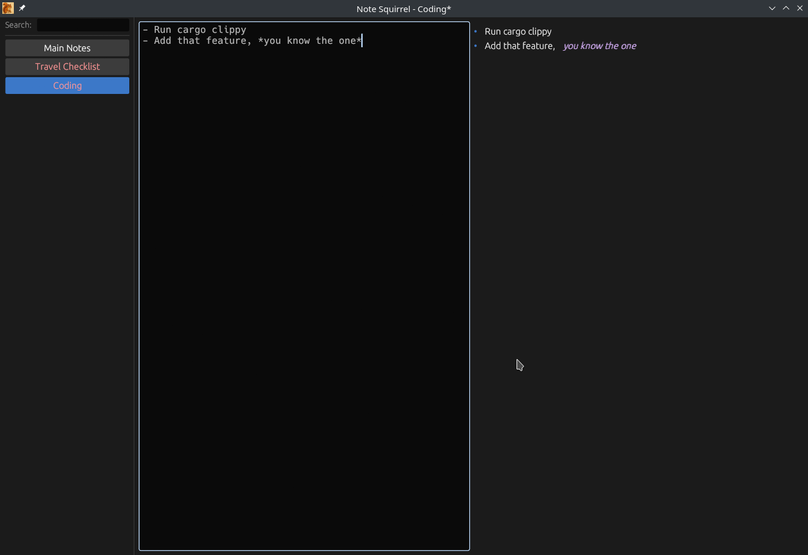

# NoteSquirrel

A fast, local note-taking application built with Rust and egui. NoteSquirrel provides a clean interface for writing and organizing markdown notes with live preview.



## Features

- Clean, distraction-free interface with sidebar note list and split editor & live markdown preview
- Markdown editor with syntax highlighting
- Interactive checkboxes in markdown preview
- Find and replace with regex and case-sensitive search support
- Match highlighting in editor
- Undo/redo support
- Quick list and checkbox insertion with automatic indentation
- Searchbar to quickly find notes
- Unsaved changes warning on exit
- Acts like an editor (Ctrl+S to save, not auto-saving)
- Cross-platform support (Linux, macOS, Windows)
- Configurable fonts, colors, and styling
- Low resource usage and snappy performance

## Keyboard Shortcuts

### File Operations
- **Ctrl+N** / **Cmd+N**: Create new note
- **Ctrl+C** / **Cmd+C**: Copy note content to clipboard (when not focused on editor)
- **Ctrl+D** / **Cmd+D**: Delete current note (with confirmation)

### Editing
- **Ctrl+Z** / **Cmd+Z**: Undo
- **Ctrl+Y** / **Cmd+Y**: Redo
- **Ctrl+,** / **Cmd+,**: Insert list item with proper indentation
- **Ctrl+.** / **Cmd+.**: Insert checkbox item with proper indentation

### Find & Replace
- **Ctrl+F** / **Cmd+F**: Open find/replace dialog
- **F3**: Next match
- **Shift+F3**: Previous match
- **Alt+R**: Replace current match (when find dialog is open)
- **Alt+A**: Replace all matches (when find dialog is open)
- **Escape**: Close find dialog

### Other
- **Double-click**: Rename note in the list

## Configuration

NoteSquirrel stores its configuration in OS-appropriate locations:

- **Linux**: `~/.config/NoteSquirrel/config.toml`
- **macOS**: `~/Library/Application Support/NoteSquirrel/config.toml`
- **Windows**: `~/AppData/Roaming/NoteSquirrel/config.toml`

### Configuration Options

The configuration file will be created automatically with default values on first run. You can customize:

- `notes_folder`: Directory where notes are stored (default: `~/local-notes`)
- `editor_font_size`: Font size for the editor pane (default: 14.0)
- `list_font_size`: Font size for the note list (default: 14.0)
- `rendered_font_size`: Base font size for rendered markdown (default: 14.0)
- `markdown_styles`: Colors and sizes for all markdown elements including:
  - Headers (h1-h6) with individual colors and sizes
  - Paragraph text, strong, emphasis, strikethrough
  - Inline code and code blocks with background color
  - List bullets and other elements

## Installation

### Pre-built Binaries

Download the latest release for your platform from the [releases page](https://github.com/danpozmanter/NoteSquirrel/releases).

You may need to make the binary executable before running it (Linux and macOS):

```
chmod u+x NoteSquirrel
```

#### macOS Note

macOS may block or delete the binary because it is not signed with an Apple Developer certificate. To allow it to run:

```
xattr -dr com.apple.quarantine NoteSquirrel
```

Then right-click the binary and select **Open**, or run it from the terminal.

### Build from Source

1. Clone the repository
2. Install Rust if not already installed
3. Run `cargo build --release`
4. The executable will be in `target/release/`

## Development

- Run with `cargo run` for development
- Build with `cargo build --release` for production
- Icons are automatically generated from the source image during build
