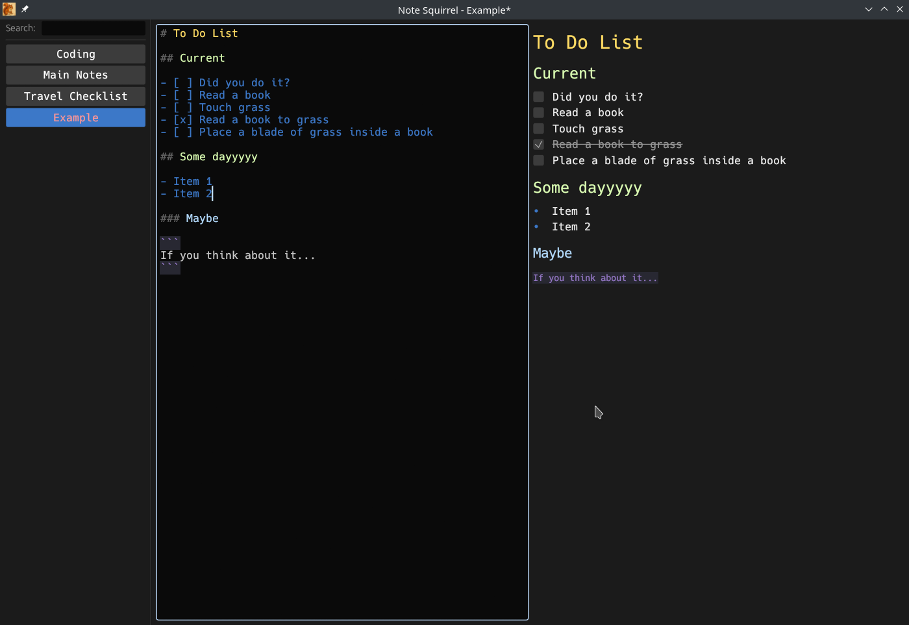

# NoteSquirrel

A fast, local note-taking application built with Rust and egui. NoteSquirrel provides a clean interface for writing and organizing markdown notes with live preview.

## Features

- Clean, distraction-free interface with sidebar note list and split editor/preview
- Live markdown rendering with syntax highlighting
- Interactive checkboxes in preview that update the source
- Search functionality to quickly find notes
- Automatic saving and dirty state tracking
- Cross-platform support (Linux, macOS, Windows)
- Configurable fonts, colors, and styling

## Keybindings

- **Ctrl+S** / **Cmd+S**: Save current note
- **Ctrl+N** / **Cmd+N**: Create new note
- **Ctrl+C** / **Cmd+C**: Copy note content to clipboard (when not focused on editor)
- **Ctrl+D** / **Cmd+D**: Delete current note (with confirmation)
- **Double-click**: Rename note in the list
- **Y/N**: Confirm/cancel delete in confirmation dialog

## Configuration

NoteSquirrel stores its configuration in OS-appropriate locations:

- **Linux**: `~/.config/NoteSquirrel/config.toml`
- **macOS**: `~/Library/Application Support/NoteSquirrel/config.toml`
- **Windows**: `~/AppData/Roaming/NoteSquirrel/config.toml`

### Configuration Options

The configuration file will be created automatically with default values on first run. You can customize:

- `notes_folder`: Directory where notes are stored (default: `~/local-notes`)
- `editor_font_size`: Font size for the editor pane (default: 14.0)
- `list_font_size`: Font size for the note list (default: 14.0)
- `rendered_font_size`: Base font size for rendered markdown (default: 14.0)
- `markdown_styles`: Colors and sizes for all markdown elements including:
  - Headers (h1-h6) with individual colors and sizes
  - Paragraph text, strong, emphasis, strikethrough
  - Inline code and code blocks with background color
  - List bullets and other elements

## Installation

1. Clone the repository
2. Install Rust if not already installed
3. Run `cargo build --release`
4. The executable will be in `target/release/`

## Development

- Run with `cargo run` for development
- Build with `cargo build --release` for production
- Icons are automatically generated from the source image during build
